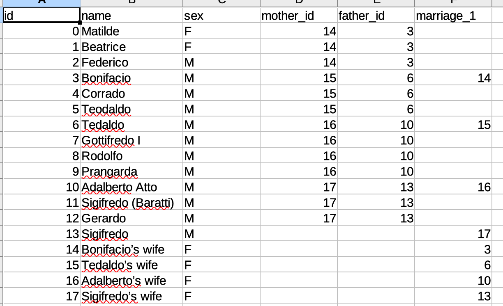
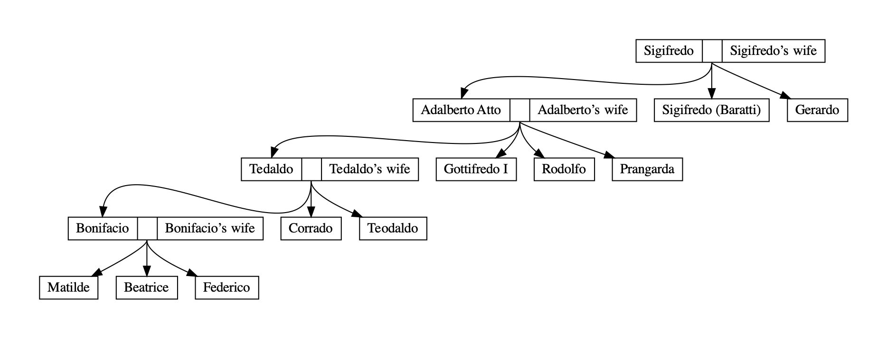

# Family tree
Code for creating a family tree, given family relationships in a csv file.

### Quickstart

CSV file formatting rules:
* Use IDs to define connections (not names).
* Insert either zero or both parents. If one parent is unknown, the other needs to be inserted anyway, for example by
calling her/him wife-of or husband of the known father.
* Arbitrary number of marriages per couple can be inserted using the name convention: marriage_1, marriage_2, ..., 
marriage_n.
* Couples need to be linked reciprocally. E.g. if John is Mary's husband, then Mary needs to inserted as John's wife.

See below an example of the csv file for the [Canossa family](https://it.wikipedia.org/wiki/Canossa_(famiglia)#Genealogia_essenziale).



and the corresponding family tree



### Installation
Requirements: Python>=3.6

Clone the repository:
```bash
$ git clone git@github.com:giaco5988/family-tree.git
```
Create virtual environment and install packages
```
$ python3 -m venv venv_ft
$ source venv_ft/bin/activate
$ cd family-tree
(venv_ft) $ pip install -r requirements.txt
```

### Run code and create family tree

Run the `main.py` script by typing
```
(venv_ft) $ python src/main.py
```
By default, the result is displayed and saved to your home directory.
